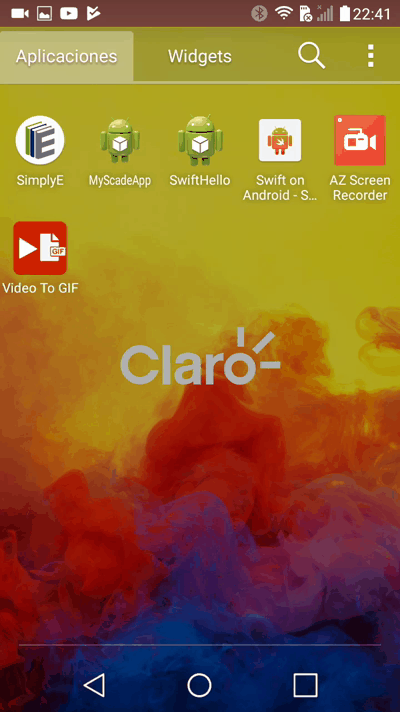

# Swift on Android - Sample1

This sample is using [swift-android-gradle](https://github.com/SwiftJava/swift-android-gradle) and [java_swift](https://github.com/SwiftJava/java_swift) to create a brigde between Swift <-> Java wrapping JNI.

In this sample I created a Native Android Activity with its Layout and then created a listener to call the swift funcion `sum()` and implemented an Interface Response to receive the response from Swift to Java.


## Preview

<p align="center">

</p>

# Steps

### Configure `swift-android-gradle` on macOS

This tool adds some gradle scripts on the build life cycle to generate Swift code and copy the binaries `*.so` on jniLibs folder.

* Download the [Swift Android Toolchain](http://johnholdsworth.com/android_toolchain.tgz).

* Decompress the `*.tgz` and change directory to the `swift-install` folder.

* Export the `ANDROID_HOME` and `JAVA_HOME` paths. 

 ```
export ANDROID_HOME=/Users/jmarkstar/Library/Android/sdk
export JAVA_HOME=/Library/Java/JavaVirtualMachines/jdk1.8.0_151.jdk/Contents/Home
```
* Execute `./setup`

### Create and Configure an Android Project

### Add the bindings Java <-> Swift

### Implement the bindings on your Activity

### Add swift and Swift package Manager files.

### Run The Project to Generate the swift stuffs.

### Implement the logic on Swift

### Run and Buhala!


